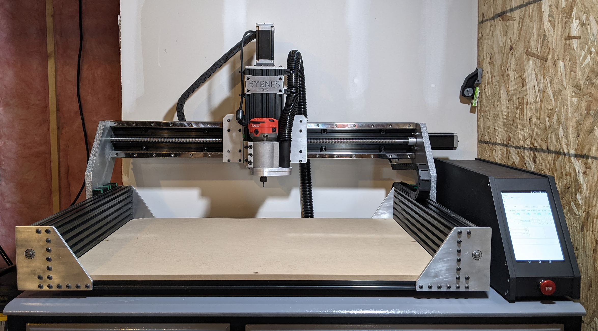
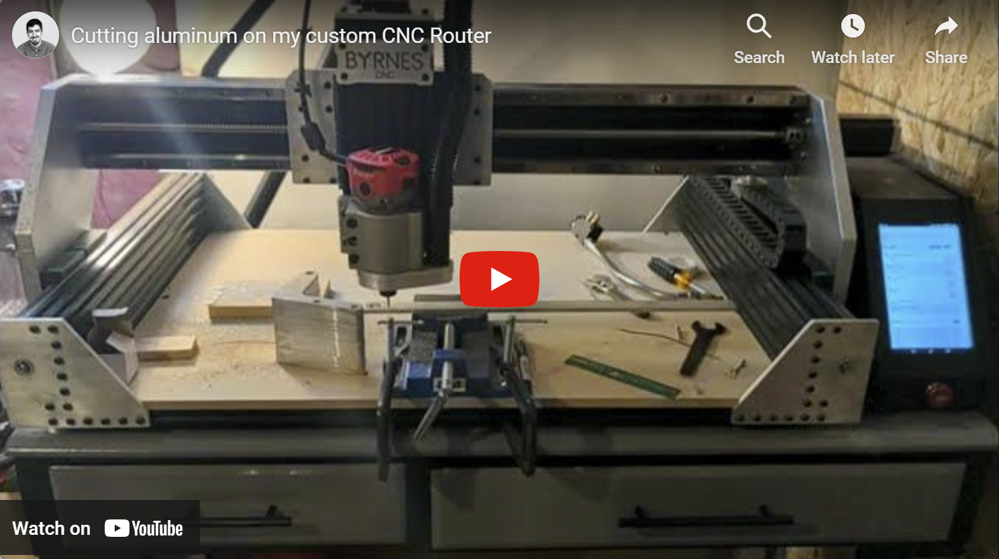
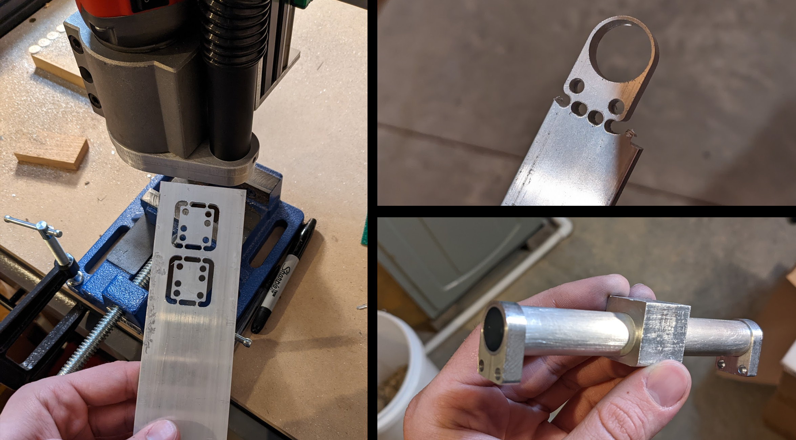
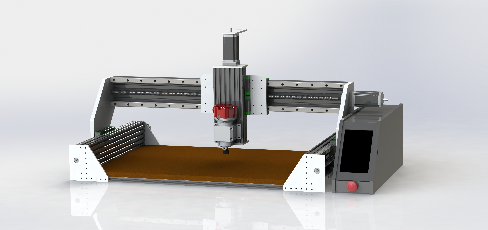
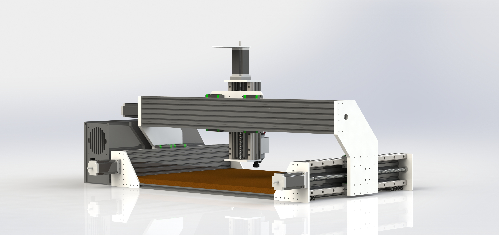

# CNC_Router
Design files for a custom CNC router I made for my home machine shop
 
 
<b>Please Note:</b> While this project does have an open source license, I don't intend on making an assembly guide or providing support, so if you've stumbled upon this page looking for an open source CNC router to make, I recommend only using this project if you're already comfortable designing and building a CNC router yourself and just want a proven starting point for the mechanical design.
 
 

  

<b>FYI: Clicking the following image will take you to the video's YouTube page.</b>

  

  

  

  

